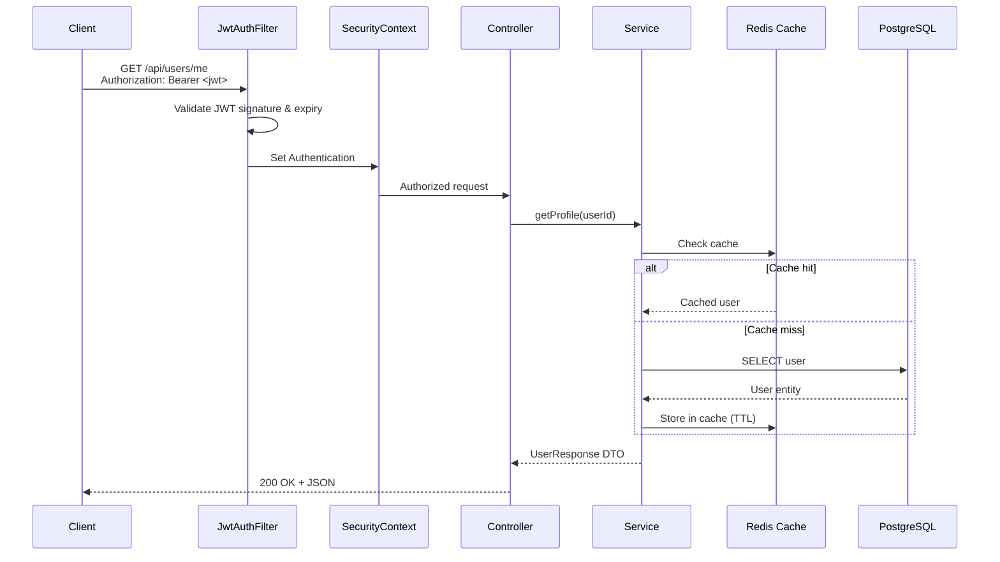

# user-service


> ### What This Demonstrates
>
> - **Production-ready Spring Boot service design** with clean layered architecture
> - **Secure authentication** with self-issued JWT, refresh token rotation, and BCrypt hashing
> - **Role-based access control (RBAC)** with method-level `@PreAuthorize` authorization
> - **Redis caching** with TTL-based eviction on reads and explicit invalidation on writes
> - **Database migrations** with Flyway — no `ddl-auto: create` shortcuts
> - **Integration testing** with Testcontainers against real PostgreSQL
> - **CI/CD pipeline** with GitHub Actions, JaCoCo coverage reporting
> - **Containerization done right** — multi-stage Docker build, non-root user, health checks

A production-grade user management and authentication service built with Spring Boot 3.5. It implements JWT-based authentication, role-based access control, Redis caching, database migrations, structured logging, and metrics -- all wired together with a clean layered architecture and backed by CI with test coverage. The goal is a service that could be deployed to production as-is, not a tutorial or proof of concept.

---

## Why This Project

Most sample Spring Boot applications stop at "it compiles." This project goes further by addressing the concerns that actually matter in production:

- **Schema management** -- Flyway migrations instead of `ddl-auto: create`.
- **Security beyond defaults** -- self-issued JWTs, refresh token rotation, BCrypt hashing, method-level authorization.
- **Caching with eviction** -- Redis-backed caching with TTL on reads and explicit eviction on writes.
- **Observability** -- structured JSON logs (Logstash encoder), Prometheus metrics via Micrometer, and Spring Actuator health checks.
- **Containerization done right** -- multi-stage Docker build, non-root runtime user, container health checks, dependency ordering in Compose.
- **Automated quality gates** -- GitHub Actions pipeline with build, test, and JaCoCo coverage reporting.

It is designed to demonstrate engineering maturity: the kind of decisions and trade-offs a senior engineer makes when building a service that other people will operate.

---

## Architecture

The project follows a clean layered architecture with clear dependency direction. Each layer has a single responsibility and depends only on the layers below it.

```
src/main/java/com/orioljt/userservice/
├── domain/              # Entities, repository interfaces, domain exceptions
├── application/         # DTOs, mappers, service layer (business logic)
├── infrastructure/      # Security (JWT, filters), caching (Redis config)
└── api/                 # REST controllers, global exception handling
```

| Layer            | Responsibility                                     |
| ---------------- | -------------------------------------------------- |
| `domain`         | JPA entities (User, Role, Permission), repository contracts, domain-specific exceptions |
| `application`    | Business logic, DTO definitions, entity-DTO mapping |
| `infrastructure` | Cross-cutting concerns: JWT issuance/validation, Spring Security configuration, Redis cache configuration |
| `api`            | HTTP interface: controllers, request validation, error response formatting |

### Request Flow



---

## Tech Stack

| Category        | Technology                          |
| --------------- | ----------------------------------- |
| Language         | Java 21                             |
| Framework        | Spring Boot 3.5.0                   |
| Build            | Gradle (Kotlin DSL)                 |
| Database         | PostgreSQL 16                       |
| Migrations       | Flyway                              |
| Caching          | Redis 7 with Spring Cache           |
| Authentication   | JJWT 0.12.6 (self-issued JWT)      |
| Authorization    | Spring Security, method-level `@PreAuthorize` |
| Validation       | Jakarta Bean Validation             |
| Observability    | Micrometer + Prometheus, Logstash Logback Encoder, Spring Actuator |
| Testing          | JUnit 5, Mockito, Testcontainers    |
| CI/CD            | GitHub Actions, JaCoCo              |
| Containerization | Docker (multi-stage), Docker Compose |

---

## Getting Started

### Prerequisites

- Docker and Docker Compose, **or**
- Java 21, PostgreSQL 16, and Redis 7 running locally

### Run with Docker Compose (recommended)

```bash
docker compose up --build
```

This starts three containers:

| Service    | Port   |
| ---------- | ------ |
| App        | `8080` |
| PostgreSQL | `5432` |
| Redis      | `6379` |

The application waits for PostgreSQL and Redis health checks to pass before starting. Flyway runs migrations on startup automatically.

### Run locally for development

Start PostgreSQL and Redis (via Docker or installed locally), then:

```bash
./gradlew bootRun
```

Default connection settings expect PostgreSQL on `localhost:5432` (database `userservice`, user `postgres`, password `postgres`) and Redis on `localhost:6379`. Override with environment variables:

```bash
DB_HOST=localhost DB_PORT=5432 DB_NAME=userservice \
DB_USERNAME=postgres DB_PASSWORD=postgres \
REDIS_HOST=localhost REDIS_PORT=6379 \
JWT_SECRET=change-me-in-production-must-be-at-least-256-bits-long-for-hmac-sha \
./gradlew bootRun
```

---

## API Reference

### Authentication

| Method | Path                  | Auth     | Description                            |
| ------ | --------------------- | -------- | -------------------------------------- |
| POST   | `/api/auth/register`  | Public   | Register a new user                    |
| POST   | `/api/auth/login`     | Public   | Authenticate and receive tokens        |
| POST   | `/api/auth/refresh`   | Public   | Exchange a refresh token for new tokens |

### Users

| Method | Path              | Auth          | Description                     |
| ------ | ----------------- | ------------- | ------------------------------- |
| GET    | `/api/users/me`   | Authenticated | Get current user's profile      |
| PUT    | `/api/users/me`   | Authenticated | Update current user's profile   |
| GET    | `/api/users/{id}` | Authenticated | Get a user by ID                |
| GET    | `/api/users`      | Admin only    | List all users (paginated)      |
| DELETE | `/api/users/{id}` | Admin only    | Delete a user                   |

### Roles

| Method | Path                        | Auth       | Description                   |
| ------ | --------------------------- | ---------- | ----------------------------- |
| GET    | `/api/roles`                | Admin only | List all roles                |
| POST   | `/api/roles`                | Admin only | Create a new role             |
| PUT    | `/api/roles/{id}/permissions` | Admin only | Assign permissions to a role |

All endpoints return a consistent `ErrorResponse` structure on failure:

```json
{
  "status": 400,
  "error": "Bad Request",
  "message": "Validation failed",
  "timestamp": "2025-01-15T10:30:00Z"
}
```

---

## Authentication Flow

The service uses a self-issued JWT model with separate access and refresh tokens. No external identity provider is required.

```
1. Register or Login
   POST /api/auth/register  or  POST /api/auth/login
   --> Response: { accessToken, refreshToken }

2. Access protected resources
   GET /api/users/me
   Authorization: Bearer <accessToken>

3. When the access token expires (1 hour), refresh it
   POST /api/auth/refresh
   Body: { "refreshToken": "<refreshToken>" }
   --> Response: { accessToken, refreshToken }
```

| Token          | Lifetime |
| -------------- | -------- |
| Access token   | 1 hour   |
| Refresh token  | 24 hours |

Passwords are hashed with BCrypt before storage. Tokens are signed with HMAC-SHA using a configurable secret (`JWT_SECRET` environment variable).

---

## Testing

### Run all tests

```bash
./gradlew test
```

### Generate coverage report

```bash
./gradlew jacocoTestReport
```

Reports are written to `build/reports/jacoco/` (HTML) and `build/reports/tests/` (test results).

### What is tested

| Type             | Tools                     | Scope                                    |
| ---------------- | ------------------------- | ---------------------------------------- |
| Unit tests       | JUnit 5, Mockito          | Service layer business logic             |
| Integration tests | Testcontainers, Spring Boot Test | Full request lifecycle against real PostgreSQL |

Integration tests use Testcontainers to spin up a real PostgreSQL instance, so no mocked repositories or in-memory databases are needed for persistence tests.

---

## Observability

### Health checks

```
GET /actuator/health    (public)
GET /actuator/info      (public)
```

The Docker container includes its own `HEALTHCHECK` instruction that polls `/actuator/health`.

### Metrics

Prometheus-compatible metrics are exposed at:

```
GET /actuator/prometheus    (admin only)
GET /actuator/metrics       (admin only)
```

Metrics are collected via Micrometer and tagged with `application=user-service`.

### Logging

- **Development**: Standard console output with DEBUG level for application code.
- **Production** (`SPRING_PROFILES_ACTIVE=prod`): Structured JSON logging via Logstash Logback Encoder, suitable for ingestion by ELK, Datadog, or any structured log aggregator.

---

## Project Structure

```
user-service-production-ready/
├── .github/
│   └── workflows/
│       └── ci.yml                          # GitHub Actions: build, test, coverage
├── src/
│   ├── main/
│   │   ├── java/com/orioljt/userservice/
│   │   │   ├── api/
│   │   │   │   ├── advice/
│   │   │   │   │   ├── ErrorResponse.java
│   │   │   │   │   └── GlobalExceptionHandler.java
│   │   │   │   └── controller/
│   │   │   │       ├── AuthController.java
│   │   │   │       ├── RoleController.java
│   │   │   │       └── UserController.java
│   │   │   ├── application/
│   │   │   │   ├── dto/
│   │   │   │   │   ├── AssignPermissionsRequest.java
│   │   │   │   │   ├── AuthResponse.java
│   │   │   │   │   ├── CreateRoleRequest.java
│   │   │   │   │   ├── LoginRequest.java
│   │   │   │   │   ├── RefreshTokenRequest.java
│   │   │   │   │   ├── RegisterRequest.java
│   │   │   │   │   ├── RoleResponse.java
│   │   │   │   │   ├── UpdateProfileRequest.java
│   │   │   │   │   └── UserResponse.java
│   │   │   │   ├── mapper/
│   │   │   │   │   └── UserMapper.java
│   │   │   │   └── service/
│   │   │   │       ├── AuthService.java
│   │   │   │       ├── RoleService.java
│   │   │   │       └── UserService.java
│   │   │   ├── domain/
│   │   │   │   ├── exception/
│   │   │   │   │   ├── DuplicateResourceException.java
│   │   │   │   │   └── ResourceNotFoundException.java
│   │   │   │   ├── model/
│   │   │   │   │   ├── Permission.java
│   │   │   │   │   ├── Role.java
│   │   │   │   │   └── User.java
│   │   │   │   └── repository/
│   │   │   │       ├── PermissionRepository.java
│   │   │   │       ├── RoleRepository.java
│   │   │   │       └── UserRepository.java
│   │   │   ├── infrastructure/
│   │   │   │   ├── cache/
│   │   │   │   │   └── CacheConfig.java
│   │   │   │   └── security/
│   │   │   │       ├── CustomUserDetails.java
│   │   │   │       ├── CustomUserDetailsService.java
│   │   │   │       ├── JwtAuthenticationFilter.java
│   │   │   │       ├── JwtProvider.java
│   │   │   │       └── SecurityConfig.java
│   │   │   └── UserServiceApplication.java
│   │   └── resources/
│   │       ├── application.yml
│   │       └── application-test.yml
│   └── test/
│       └── java/com/orioljt/userservice/
│           ├── TestcontainersConfiguration.java
│           └── TestUserServiceApplication.java
├── build.gradle.kts
├── docker-compose.yml
├── Dockerfile
├── gradlew
├── gradlew.bat
└── settings.gradle.kts
```

---

## Use Case

**Who would use this:** Any team that needs a user management and authentication service as part of a larger platform — as a standalone auth service or as a template for building secured Spring Boot APIs.

**Where this fits:** This service sits at the edge of a backend platform, handling user registration, login, token management, and access control. In a microservices architecture, it would be the identity service that other services delegate authentication to.

**Real-world scenarios this solves:**
- Onboarding new users with secure registration and email uniqueness enforcement
- Issuing and rotating JWT tokens without depending on an external identity provider
- Enforcing role-based permissions across API endpoints
- Caching frequently accessed user profiles to reduce database load

---

## License

This project is licensed under the [MIT License](LICENSE).
